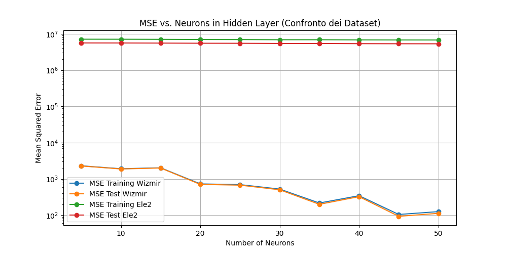

# Neural Regressor

## Description
This project implements a series of feedforward neural network models to predict target values from regression datasets. Using TensorFlow and Keras, the project explores the impact of different numbers of neurons in the hidden layer on the model's performance, measured by the mean squared error (MSE).

## Installation
To set up the environment, follow these steps:

1. Clone the project repository:
   ```bash
   git clone https://github.com/simonediaco/neural-regress.git
   ```
2. Navigate to the project folder
   ```bash
   cd neural-regress
   ```
3. Create and activate a virtual environment (optional but recommended):
   ```bash
   python -m venv venv
   source venv/bin/activate
   ```
4. Install the required dependencies:
   ```bash
   pip install -r requirements.txt
   ```
## Usage
To run the analysis and visualize the results, execute the main script:
   ```bash
   python main.py
   ```
This script will read the provided datasets, train the neural network models, and generate a plot showing the mean squared error (MSE) as a function of the number of neurons in the hidden layer, comparing both datasets.

## Result
The resulting plot shows the Mean Squared Error (MSE) as a function of the number of neurons in the hidden layer for both datasets:



