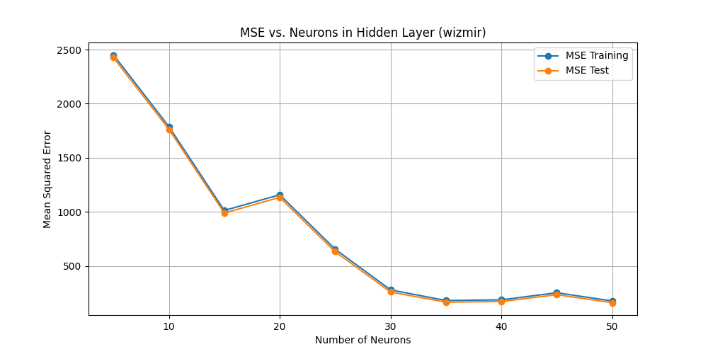
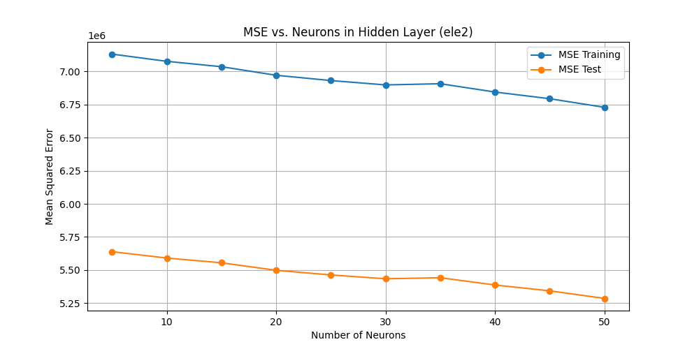

# Neural Regressor

## Descrizione
Questo progetto implementa una serie di modelli di rete neurale feedforward per prevedere valori target da dataset di regressione. Attraverso l'uso di TensorFlow e Keras, il progetto esplora l'impatto di diversi numeri di neuroni nello strato nascosto sulla performance del modello, misurata tramite l'errore quadratico medio (MSE).

## Configurazione

1. Clona il repository del progetto:

    ```git clone URL_DEL_REPOSITORY ```

2. Crea e attiva un ambiente virtuale (opzionale):

    ``` ```

    ``` ```

3. Installa le dipendenze necessarie:

    ``` ```

    ``` ```
## Run


## Risultati

### Dataset Wizmir

La figura seguente mostra chiaramente come il Mean Squared Error (MSE) varia in funzione del numero di neuroni nello strato nascosto delle reti neurali utilizzate per il dataset Wizmir.



### Dataset Ele2

La figura seguente mostra chiaramente come il Mean Squared Error (MSE) varia in funzione del numero di neuroni nello strato nascosto delle reti neurali utilizzate per il dataset Ele2.


